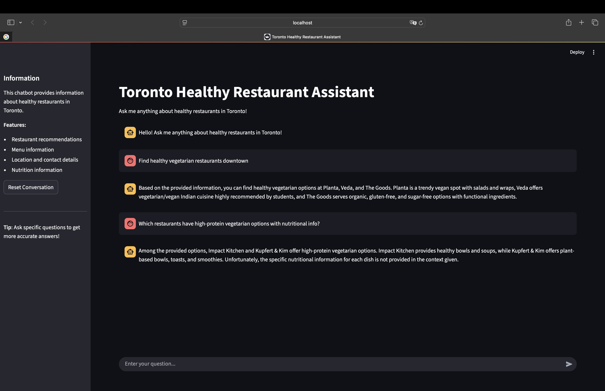

# Healthy Toronto Agent
*한국어 | [English](README.md)*

토론토에서 건강하고 저렴한 식당을 찾아주는 **RAG 기반 챗봇**입니다.  
LangChain, OpenAI API, Chroma Vector DB, Streamlit을 활용하여 구축하였습니다.  

## 주요 기능
- 🔍 의미 기반 검색: 벡터 검색으로 식당 데이터베이스 탐색  
- 💬 대화형 인터페이스: 사용자 맥락을 반영한 맞춤형 추천  
- 🌐 실시간 응답: 스트리밍 기능으로 빠른 대화 경험  
- 📊 조건 필터링: 채식, 글루텐프리 등 특정 식단 옵션 지원  

## 기술 스택
- **LangChain**: RAG 파이프라인 구현  
- **OpenAI API**: 자연어 이해  
- **Chroma**: 벡터 검색 DB  
- **Streamlit**: 웹 인터페이스  
- **Python**: 데이터 처리  

## 데모
 

---

📌 본 프로젝트는 2025년 5월 **AICamp – AI Meetup Toronto**에서 영감을 받아 개발되었습니다.  
데이터셋은 공개된 식당 정보를 직접 수집해 구성하였으며, 저작권 문제는 없습니다.
