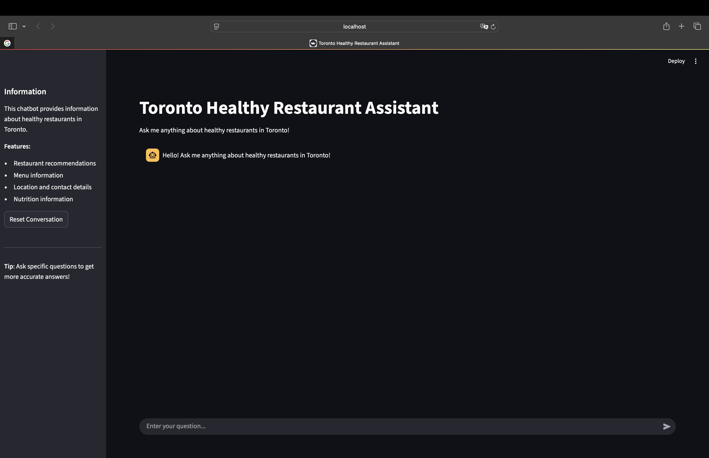
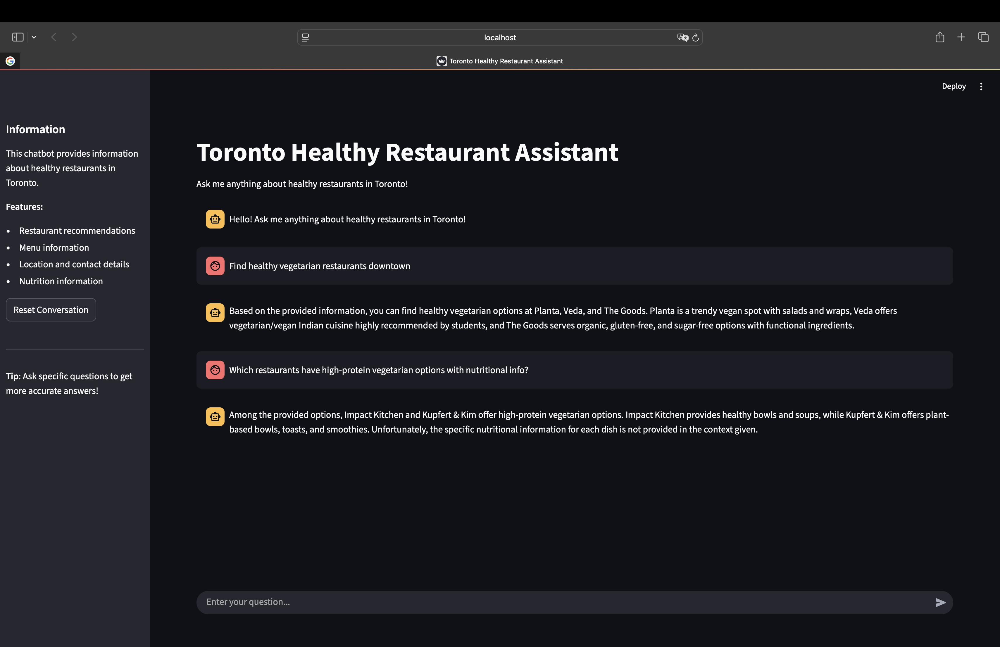

# Healthy Toronto Agent

Find healthy and affordable food in Toronto - no cooking required.

## Demo
 
*Interactive chat interface with restaurant recommendations*

## Tech Stack


- **LangChain**: RAG (Retrieval-Augmented Generation) framework
- **OpenAI API**: Large Language Model for natural language understanding
- **Chroma**: Vector database for semantic search
- **Streamlit**: Web interface for interactive chatbot
- **Python**: Core programming language with pandas for data processing

## Features

- 🔍 Semantic search through Toronto restaurant database
- 💬 Conversational AI with memory and context
- 🌐 Clean web interface with real-time responses
- 📊 Vector-based retrieval for accurate restaurant recommendations
- 🔄 Session management with conversation history

## Project Structure

```
healthy-toronto-agent/
├── ingest.py           # Create vector DB from CSV
├── agent.py            # Streamlit web app with LangChain RAG
├── data/
│   └── healthy_toronto_eat.csv  # Restaurant dataset
├── db/                 # Chroma vector DB (not in git)
├── assets/             # App demo screenshots
├── README.md           # This file
├── development-log.md  # Development challenges and learnings
└── requirements.txt    # Required packages
```

## Setup

1. Install requirements:
```
pip install -r requirements.txt
```

2. Add your OpenAI API key to a `.env` file:
```
OPENAI_API_KEY=your_key_here
```

## Usage

1. Create vector database (once):
```
python ingest.py
```

2. Run the Streamlit web app:
```
streamlit run agent.py
```

3. Ask questions like:
   - "Find healthy vegetarian restaurants downtown"
   - "What are affordable options near University of Toronto?"
   - "Show me places with gluten-free options"

For detailed development insights and challenges faced, see [development-log.md](development-log.md).

## Inspiration

Inspired by **Aurora Li** and **Cole Bowden** at AI Meetup Toronto by **AICamp** (May 2025).

---

🗂️ Dataset constructed manually using publicly available restaurant information (e.g., address, category, dietary options). No copyrighted content used.